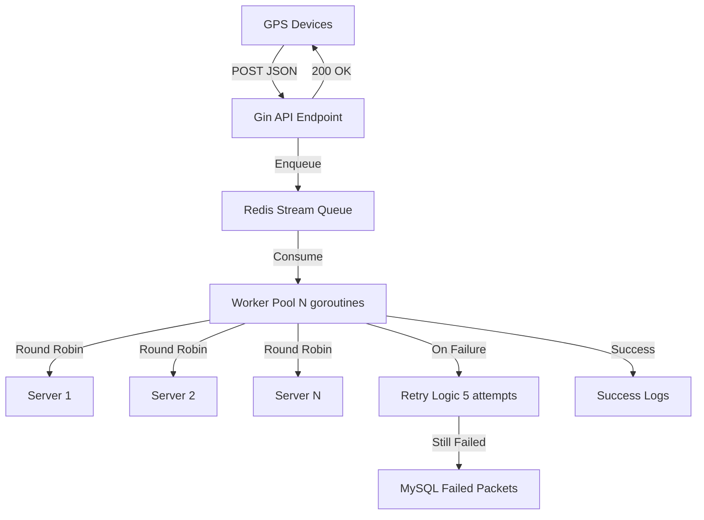

# GPS Data Receiver System - Implementation Plan

## Architecture Overview




## Project Structure

```javascript
gps-data-receiver/
├── cmd/
│   └── server/
│       └── main.go              # Application entry point
├── internal/
│   ├── api/
│   │   ├── handler.go           # HTTP handlers
│   │   └── middleware.go        # Rate limiting, logging
│   ├── models/
│   │   └── gps_data.go          # GPS data structures
│   ├── queue/
│   │   ├── redis_queue.go       # Redis Stream operations
│   │   └── consumer.go          # Worker pool consumer
│   ├── sender/
│   │   ├── http_sender.go       # HTTP client with retries
│   │   └── load_balancer.go     # Round-robin logic
│   ├── storage/
│   │   ├── mysql.go             # MySQL operations
│   │   └── repository.go        # Failed packet repository
│   └── config/
│       └── config.go            # Configuration management
├── pkg/
│   └── logger/
│       └── logger.go            # Structured logging
├── tests/
│   ├── integration/
│   │   ├── api_test.go          # API integration tests
│   │   ├── queue_test.go        # Queue integration tests
│   │   └── sender_test.go       # Sender integration tests
│   └── unit/
│       ├── handler_test.go      # Unit tests for handlers
│       └── load_balancer_test.go # Load balancer tests
├── scripts/
│   └── load_test.sh             # Load testing script
├── docker-compose.yml           # Redis, MySQL containers
├── Dockerfile                   # Multi-stage build
├── go.mod
├── go.sum
├── .env.example
├── Makefile                     # Build, test, run commands
└── README.md
```


## Implementation Steps

### 1. Project Initialization & Configuration

- Initialize Go module with Gin, Redis client (go-redis/redis), MySQL driver (go-sql-driver/mysql), GORM
- Create configuration struct with env variable loading (server URLs, Redis, MySQL, worker count)
- Setup structured logger (zap or logrus)
- Create `.env.example` with all required variables

### 2. Data Models

- Define `GPSPacket` struct to hold raw JSON payload (using json.RawMessage for pass-through)
- Create `FailedPacket` model for MySQL persistence with retry count, error message, timestamps
- **No validation** - accept any JSON payload as-is for pure transfer

### 3. API Layer (`internal/api/`)

- **Handler**: POST `/api/gps/reports` endpoint
- Accept raw JSON body (no parsing or validation)
- Read request body as-is
- Enqueue raw payload to Redis Stream (non-blocking, immediate response)
- Return 200 OK with message ID
- Handle errors: 500 (queue failure), 503 (service unavailable)
- **Middleware**: 
- Request ID generation for tracing
- Structured logging (request/response)
- Rate limiting (token bucket algorithm) to prevent overload
- Panic recovery
- Request timeout (e.g., 5 seconds)
- Content-Type check (should be application/json)
- Request size limit (e.g., max 1MB per packet for DoS protection)

### 4. Redis Queue (`internal/queue/`)

- **redis_queue.go**: 
- Use Redis Streams (XADD) for high-throughput queuing
- Stream name: `gps:reports`
- Configure maxlen to prevent unbounded growth
- Connection pooling for performance
- **consumer.go**: 
- Worker pool with configurable goroutines (e.g., 50-100 workers)
- XREADGROUP for consumer group pattern (ensures exactly-once processing)
- Graceful shutdown with context cancellation
- Batch processing for efficiency

### 5. HTTP Sender (`internal/sender/`)

- **http_sender.go**: 
- HTTP client with connection pooling (MaxIdleConns, MaxConnsPerHost)
- Exponential backoff retry: 5s, 10s, 10s, 10s, 10s delays
- Timeout per request (e.g., 30 seconds)
- Circuit breaker pattern to avoid cascading failures
- Track metrics: success rate, latency, failures
- **load_balancer.go**: 
- Round-robin server selection with atomic counter
- Health check mechanism (mark servers as down/up)
- Concurrent-safe implementation

### 6. MySQL Storage (`internal/storage/`)

- **mysql.go**: 
- Connection pool with optimal settings (SetMaxOpenConns, SetMaxIdleConns, SetConnMaxLifetime)
- Graceful connection handling with retries
- **repository.go**: 
- `SaveFailedPacket()` method with prepared statements
- Schema: id, payload (JSON/TEXT), retry_count, last_error, target_server, created_at, updated_at
- Index on created_at for queries and cleanup
- Optional: cleanup job for old failed packets (e.g., > 30 days)

### 7. Worker Orchestration

- Main worker loop in `cmd/server/main.go`:
- Initialize Redis consumer group
- Spawn N worker goroutines
- Each worker: consume → send → ACK/NACK → retry logic
- Retry logic flow:

1. Attempt to send to next round-robin server
2. If fails, wait (5s, 10s, 10s, 10s, 10s)
3. After 5 attempts, persist to MySQL
4. Log failure with full context

### 8. Testing Strategy

**Unit Tests** (~15 tests):

- Load balancer: round-robin distribution, concurrent access
- Handler: raw body acceptance, error cases, size limits
- Config: environment variable loading
- Middleware: rate limiting, request ID generation

**Integration Tests** (~10 tests):

- End-to-end: POST request → Redis → Worker → Mock server → Success
- Retry flow: POST → Redis → Worker → Failed server → Retry → Success
- Failure persistence: POST → Redis → Worker → All retries failed → MySQL record
- Concurrent load: 1000 simultaneous requests, verify all processed
- Redis failure handling: Redis down, graceful error
- MySQL connection tests

**Load Tests**:

- Artillery or vegeta to simulate 10k+ req/min
- Monitor: response times, queue depth, error rates
- Verify system doesn't degrade under load

### 9. Security Measures

- **No content validation** - accept any JSON payload (pure pass-through)
- Rate limiting per IP (middleware) - critical for preventing abuse
- Request size limits (e.g., 1MB max) - prevents memory exhaustion
- SQL injection prevention (prepared statements, GORM)
- Redis AUTH password
- Connection timeout limits on all network operations
- Panic recovery middleware
- Secrets in environment variables (never hardcoded)
- HTTPS ready (TLS configuration placeholder)
- DDoS protection via rate limiting and request size caps

### 10. Performance Optimizations

- Connection pooling: HTTP, Redis, MySQL
- Redis pipelining for bulk operations
- Goroutine pool (don't spawn unlimited workers)
- JSON encoding/decoding optimization (json-iterator/go)
- Middleware ordering (rate limit early)
- Buffered channels for internal communication
- Memory profiling and optimization
- CPU profiling under load
- Graceful shutdown to prevent data loss

### 11. Observability

- Structured logging with levels (debug, info, warn, error)
- Request tracing with correlation IDs
- Metrics: packets received, processed, failed, latency percentiles
- Health check endpoint: `/health` (checks Redis, MySQL connectivity)
- Ready check endpoint: `/ready`
- Optional: Prometheus metrics endpoint

### 12. Docker & Deployment

- Multi-stage Dockerfile (build → minimal runtime)
- docker-compose.yml with Redis, MySQL, app service
- Environment-based configuration
- Volume mounts for logs
- Health checks in docker-compose

### 13. Documentation

- README with architecture diagram, setup instructions, API documentation
- .env.example with all variables explained
- Makefile with common commands (build, test, run, docker-up, docker-down)
- API endpoint documentation (request/response format)

## Key Technical Decisions

1. **Redis Streams over Lists**: Streams provide consumer groups for reliability and horizontal scaling
2. **Round-robin with health checks**: Distributes load while avoiding dead servers
3. **Exponential backoff**: 5s initial, then 10s for remaining attempts balances retry speed and server protection
4. **Worker pool**: Fixed goroutine pool prevents resource exhaustion under high load
5. **Circuit breaker**: Prevents wasting resources on consistently failing servers
6. **MySQL for failures**: Durable storage for investigation and potential replay